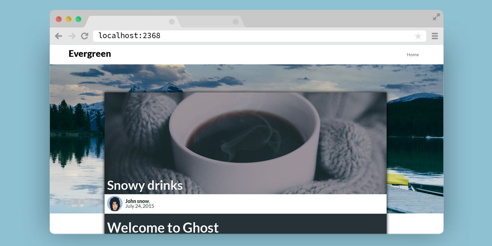
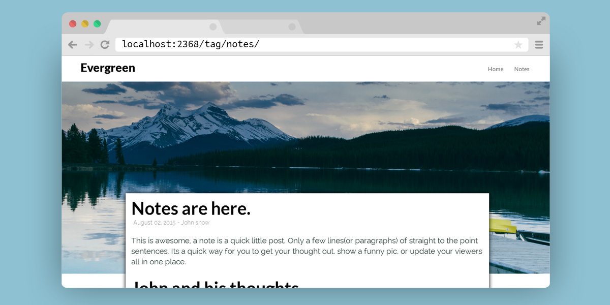

# Evergreen
a Material Influenced ghost theme.

if you see a bug or have a brilliant idea on how to improve Evergreen, [create a new issue](https://github.com/DanielTamkin/Evergreen/issues) or Tweet me [@CodeHands](https://twitter.com/CodeHands)

#### Guess what, Notes Are here!
A note is a quick little post. Only a few lines(or paragraphs) of straight to the point sentences. Its a quick way for you to get your thought out, show a funny pic, or update your viewers all in one place. or update your viewers all in one place.

Just add the note tage (`!note`) and your done!

### Installation
 1. Install Placidity to your Themes directory located at `ghost\content\themes`
 2. login to your ghost admin panel.
 3. navigate to your `settings/general` panel.
 4. Change your Theme setting to `Evergreen`

 ### Home
 

 ### Notes

 

 ### Loop
 

 ### Tag
 

 ### Post
 

 ### Author
 

 Details
 ---
 | Fonts  | jQuery plugins |
 | ------------- | ------------- |
 | [Lato](https://www.google.com/fonts#UsePlace:use/Collection:Lato)  | [shimThis.js](https://github.com/DanielTamkin/shimThis.js)  |
 | [Raleway](https://www.google.com/fonts#UsePlace:use/Collection:Raleway)  | [centerThis.js](https://github.com/DanielTamkin/centerThis.js) |
 || [AnchorSlide.js](https://github.com/DanielTamkin/AnchorSlide.js) |

 

 

   
 

